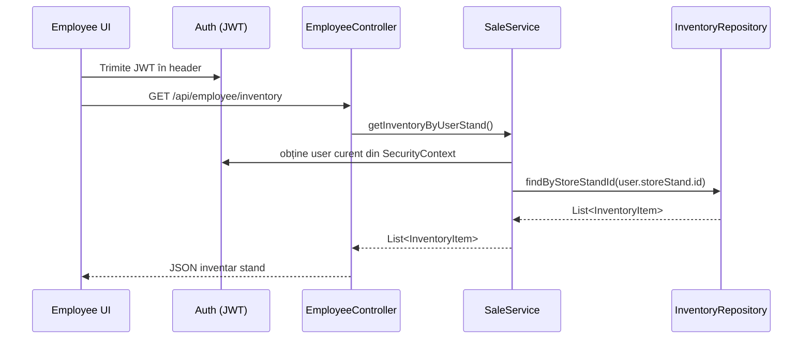
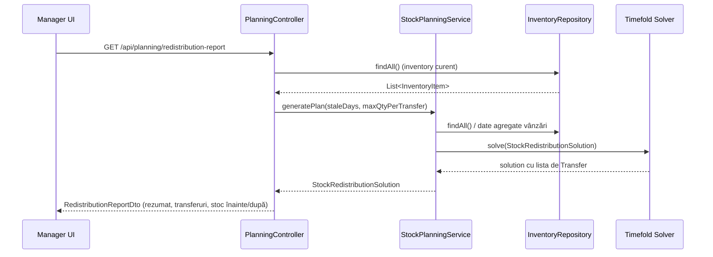

# CodeAndStock

Aplicație pentru lanțuri de magazine de accesorii GSM care:

- gestionează **stocul pe standuri de mall** (inventar, vânzări);
- oferă **analiză de vânzări** (ce se vinde cel mai bine);
- propune **redistribuiri de stoc** între standuri folosind Timefold;
- are ecrane separate pentru **angajați** (gestiune stand) și **manageri** (vedere globală, predicție).

---

## Structură proiect

```
CodeAndStock/
├── pom.xml           # Parent Maven (module: backend)
├── backend/          # API REST, Timefold, JPA, Security, PostgreSQL
│   ├── pom.xml
│   ├── src/
│   └── mvnw, .mvn
└── frontend/         # React + Vite + Cloudscape (UI login, employee, manager)
    ├── package.json
    └── src/
```

---

## Ce face aplicația

- **Autentificare (JWT)**
  - Utilizatori demo în `data.sql` (parolă implicită: `password123`).
  - Roluri: `ROLE_EMPLOYEE`, `ROLE_MANAGER`, `ROLE_ADMIN`.

- **Ecran angajat stand (Employee)**
  - Afișează **inventarul standului curent** (SKU, produs, preț, stoc cu indicator colorat).
  - Căutare după SKU/nume.
  - „Coș” de produse; la **Save Sale**:
    - creează o înregistrare în `sales`;
    - scade automat stocul din `inventory`.

- **Ecran manager (ManagerDashboard, temă dark)**
  - **Filtru căutare + Stock (toate standurile)**:
    - inventar consolidat pe produs + stand (mall + oraș) + stoc.
  - **Analiza stoc**:
    - agregă vânzările din toate standurile pe produs;
    - ordonează descrescător după `Vândute` => vezi rapid ce se vinde cel mai bine.
  - **Redistribuire stoc**:
    - apelează Timefold prin `/api/planning/redistribution-report`;
    - afișează mutări propuse: produs, stand sursă, stand destinație, cantitate, explicație text;
    - buton „Reîmprospătare predicție” recalculă planul foarte rapid.

- **Optimizare cu Timefold**
  - **Entitate de planificare**: `Transfer` (mutare X bucăți din stand A în stand B pentru un produs).
  - **Solution**: `StockRedistributionSolution` (inventar + lista de transferuri).
  - **Rule (ConstraintProvider)**:
    - transfer **doar în același oraș** (hard);
    - nu se depășește stocul sursă (hard);
    - se preferă mutarea stocului foarte vechi (soft).

- **Date demo coerente (data.sql)**
  - Standuri plasate în mall-uri reale:
    - AFI Cotroceni, Mega Mall, City Park Mall Constanța, Iulius Mall Cluj, Palas Mall Iași, Iulius Town Timișoara.
  - Catalog redus de ~6 produse (huse, folii, încărcător, cablu) pentru scenarii ușor de urmărit.
  - Inventar și vânzări simulate pentru a genera:
    - produse cu stoc mare și vânzări mici (candidate pentru mutare);
    - standuri „fierbinți” unde anumite produse se vând foarte bine.

---

## Backend

- **Tehnologii:** Spring Boot 3, JPA/Hibernate, PostgreSQL, Timefold Solver, Spring Security, JWT.
- **Rulare:**

```bash
cd backend
mvn spring-boot:run
```

- **Baza de date:**
  - Creează baza `phone_accessories_stock` în PostgreSQL.
  - `application.properties` conține:

```properties
spring.datasource.url=jdbc:postgresql://localhost:5432/phone_accessories_stock
spring.datasource.username=postgres
spring.datasource.password=pass

spring.sql.init.mode=always
spring.jpa.defer-datasource-initialization=true
```

  - La fiecare pornire, `data.sql` face `TRUNCATE` și reîncarcă datele demo (standuri, produse, inventar, vânzări, utilizatori).

---

## Frontend

- **Tehnologii:** React 18+, Vite, Cloudscape Design System.
- **Rolare în mod dev (Vite):**

```bash
cd frontend
npm install
npm run dev
```

- Vite rulează de obicei pe `http://localhost:5173`, cu proxy `/api` către backend-ul de pe `http://localhost:8080`.
- Rute principale:
  - `/login` – autentificare.
  - `/register` – cerere de acces.
  - `/manager` – dashboard manager (stock global, analiză, redistribuire).

---

## Build backend

Din rădăcina proiectului:

```bash
mvn clean install
```

Construiește modulul `backend` ca aplicație Spring Boot. Frontend-ul se rulează separat cu `npm run dev` (sau se poate construi cu `npm run build` și integra într-un pipeline propriu).

---

## Arhitectură conceptuală

```mermaid
flowchart LR
  subgraph Client
    Browser[UI React (Login, Employee, Manager)]
  end

  subgraph Backend[Spring Boot API]
    Auth[Auth & JWT]
    EmployeeAPI[Employee API<br/>/api/employee]
    SalesAPI[Sales API<br/>/api/sales]
    ProductsAPI[Products API<br/>/api/products]
    PlanningAPI[Planning API<br/>/api/planning]
    Services[Services & Timefold<br/>StockPlanningService,<br/>AnalyticsService,<br/>SaleService]
  end

  subgraph DB[PostgreSQL]
    Users[(app_users)]
    Stands[(store_stands)]
    Products[(products)]
    Inventory[(inventory)]
    Sales[(sales)]
  end

  Browser -->|JWT login| Auth
  Browser --> EmployeeAPI
  Browser --> SalesAPI
  Browser --> ProductsAPI
  Browser --> PlanningAPI

  Auth --> Users
  EmployeeAPI --> Inventory
  SalesAPI --> Sales & Inventory
  ProductsAPI --> Products
  PlanningAPI --> Services
  Services --> Products & Inventory & Sales & Stands
```

---

## Use cases principale

- **UC1 – Login utilizator**
  - Actor: angajat / manager.
  - Pași:
    1. Introduce user + parolă în `/login`.
    2. Frontend → `POST /api/auth/login`.
    3. Backend validează credentialele, generează JWT, îl întoarce.
    4. Frontend salvează tokenul în `localStorage` și redirecționează la `/manager` sau la pagina de employee.

- **UC2 – Vizualizare stoc per stand (Employee)**
  - Actor: angajat stand.
  - Pași:
    1. Angajatul deschide ecranul de gestiune stand.
    2. Frontend → `GET /api/employee/inventory` (cu JWT).
    3. Backend identifică user-ul și standul asociat și returnează inventarul din `inventory`.
    4. UI afișează lista cu statusuri de stoc (verde/galben/roșu) și permite vânzarea produselor.

- **UC3 – Înregistrare vânzare**
  - Actor: angajat stand.
  - Pași:
    1. Angajatul adaugă produse în „Coș” și apasă „Save Sale”.
    2. Frontend trimite `POST /api/employee/sale` cu produs, stand, cantitate.
    3. Backend verifică:
       - că utilizatorul aparține standului;
       - că există suficient stoc în `inventory`.
    4. Dacă totul e ok:
       - scade cantitatea din `inventory`;
       - inserează rând în `sales`.

- **UC4 – Analiză globală stoc (Manager)**
  - Actor: manager.
  - Pași:
    1. Managerul deschide `/manager`.
    2. Frontend cheamă:
       - `GET /api/inventory/...` (toate standurile);
       - `GET /api/sales/all` (toate vânzările).
    3. Backend întoarce inventar + vânzări.
    4. UI:
       - afișează grid cu stock pe standuri;
       - calculează top produse vândute și le afișează în „Analiza stoc”.

- **UC5 – Generare plan de redistribuire (Timefold)**
  - Actor: manager.
  - Pași:
    1. Managerul apasă „Reîmprospătare predicție” pe pagina manager.
    2. Frontend → `GET /api/planning/redistribution-report?staleDays=100&maxQtyPerTransfer=50`.
    3. Backend:
       - citește inventarul și vânzările agregate;
       - construiește `StockRedistributionSolution` cu entități `Transfer`;
       - pornește solver-ul Timefold care maximizează mutarea stocului vechi, respectând rulele (nu depășește stocul, rămâne în același oraș);
       - întoarce un raport cu:
         - stoc inițial,
         - listă de transferuri cu explicații,
         - stoc estimat după mutare.
    4. UI afișează tabelul „Redistribuire stoc”.

---

## Diagrame de secvență (Mermaid)

### UC2 – Vizualizare stoc per stand (Employee)



### UC5 – Generare plan redistribuire (Manager)



